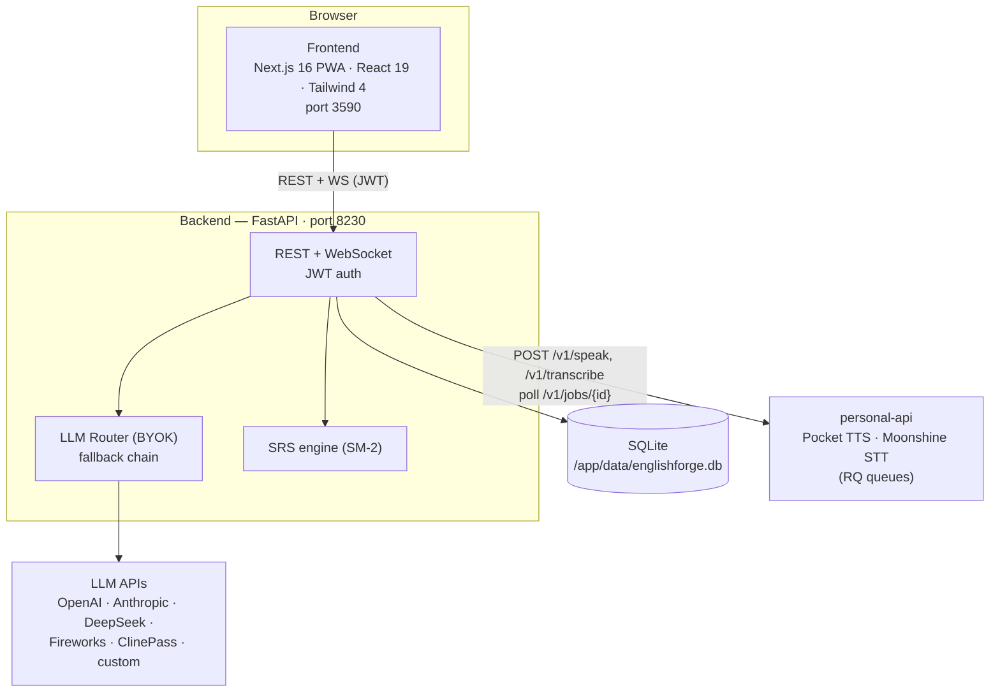
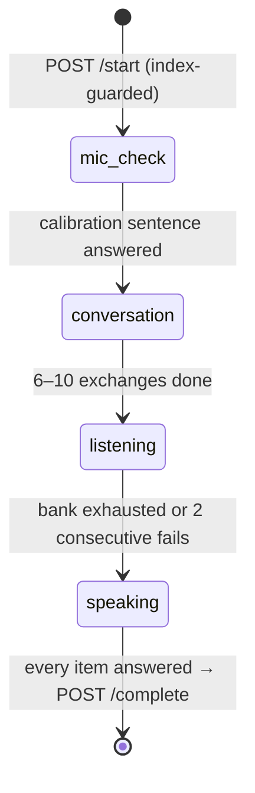

# EnglishForge — Technical Design

How the system is actually built. For *what* it does (domain, features, data model), see [`spec.md`](./spec.md). Decision history lives in [`ADR.md`](./ADR.md).

## System Context

- **Deployment**: single Docker Compose stack (`frontend`, `backend`). Data persists in SQLite (`sqlite+aiosqlite:///./data/englishforge.db`) on the `backend_data` volume (`/app/data`), with WAL mode + busy_timeout applied at startup for concurrent access. The backend joins the external `coolify` network to reach `personal-api` by service name.
- **Ports**: frontend 3590, backend 8230.

## Backend Layers

| Layer | Location | Responsibility |
|---|---|---|
| Routers | `backend/app/routers/` | 12 routers: `auth`, `sessions`, `messages`, `vocab`, `scenarios`, `settings`, `dashboard`, `lessons`, `ws`, `tutor_profile`, `assessment`, `learning_paths`. All user-scoped resources go through the `get_current_user` JWT dependency. |
| LLM | `backend/app/llm/` | Provider adapters (`openai_compatible.py`, `anthropic_adapter.py`) behind a `ChatProvider` interface; `router.py` orders providers by priority, falls back through the chain, and hosts the tolerant JSON parsers (`parse_llm_json`, `parse_lesson_json`). `prompts.py` holds all system prompts plus the CEFR learning-path framework (`LEVEL_LESSONS_REQUIRED`, `NEXT_LEVEL`, `LEVEL_FOCUS`). |
| Integrations | `backend/app/integrations/` | `tts_personal_api.py` and `stt_personal_api.py` (async job submission + polling against personal-api; every `/v1/speak` pins `model=TTS_MODEL` and every `/v1/transcribe` sends `language=STT_LANGUAGE` — see ADR-013), `stt_whisper_server.py` (faster-whisper in-process, optional dependency), `crypto.py` (Fernet encryption of provider API keys — key from `SETTINGS_ENCRYPTION_KEY` or derived from `JWT_SECRET_KEY`). |
| Services | `backend/app/services/` | `assessment_flow.py` — the assessment phase state machine (`handle_message()` dispatches `mic_check` → `conversation` → `listening` → `speaking`) plus the completion analysis and TTS caching; `assessment_bank.py` — fixed listening/speaking item banks; `assessment_scoring.py` — deterministic CEFR aggregation (dimension bands, conservative median level, confidence); `pronunciation.py` — WER + phoneme PER + fluency scoring; `stt.py` — shared STT entry point under a global 1-job semaphore (personal-api Moonshine first, in-process faster-whisper fallback). |
| Domain | `backend/app/lessons/`, `backend/app/srs/` | Static lesson library (no LLM needed) and the SM-2 spaced-repetition implementation. |
| Data | `backend/app/models/`, `backend/app/schemas/` | SQLAlchemy 2.0 async ORM (15 tables) and Pydantic response schemas. |
| App | `backend/app/main.py` | Lifespan: drift validation of `_COLUMNS_TO_ADD` against the ORM metadata → `create_all` → `_ensure_new_columns_sync` (`_COLUMNS_TO_ADD` + savepoint guards) → `_ensure_indexes_sync` (`_INDEXES_TO_ADD` partial unique indexes). Global 500 handler. |

### Startup schema sync

`Base.metadata.create_all()` never alters existing tables, so the lifespan runs two idempotent syncs:

1. **Columns** — `_COLUMNS_TO_ADD` adds missing columns inside `begin_nested()` savepoints: the original trio (`users.current_level`, `users.assessment_completed`, `progress_daily.lessons_completed`) plus the assessment v2 columns (`assessments.phase`/`section_step`/`dimension_scores` and `assessment_messages.kind`/`audio_url`/`metrics`/`item_id` — the item id backing the one-answer-per-item unique index). Concurrent-startup races are detected and skipped, real failures are logged loudly.
2. **Indexes** — `_INDEXES_TO_ADD` creates partial unique indexes enforcing cross-request invariants (one in-progress assessment / one active learning path per user; one answer per banked assessment item via `uq_assessment_messages_user_item` on `(assessment_id, item_id)`), making the corresponding application guards atomic (ADR-007).

A validation step warns if `_COLUMNS_TO_ADD` drifts from `models.py`.

## Key Flows

### Conversation turn

The conversation turn never fails on an LLM outage: if every provider fails (or all output is unusable), the backend replies with a fixed recovery line ("Sorry, I lost my train of thought…") so the conversation stays alive — the student's next message retries the LLM with full history. Corrections attach only to the user's message; `assistant_message.corrections` is always empty (the previous legacy duplication rendered each correction twice in the UI).

The conversation and assessment pages always run Web Speech API in the browser; `whisper_server` and `personal_api` STT modes execute server-side in the WS flow. (`whisper_wasm` is selectable in Settings but not yet implemented client-side.)

### Assessment (multi-skill flow)

The entire phase state machine lives in `app/services/assessment_flow.py` (ADR-012); the router (`routers/assessment.py`) keeps only HTTP concerns — request validation, auth, recording upload — and delegates every state transition.

1. `POST /api/assessment/start` — guarded by the partial unique index `uq_assessments_user_in_progress` (one in-progress assessment per user; duplicate starts fail atomically, not via SELECT-then-INSERT).
2. `POST /api/assessment/{id}/message` — the single entry point for every phase; `handle_message()` dispatches on `assessments.phase`:
   - **mic_check** — voice-only (a non-voice source is rejected with HTTP 400 — a typed answer would bypass the measurement): one fixed calibration sentence, then the LLM greets and opens the interview.
   - **conversation** — LLM interview, min 6 / max 10 exchanges (`MIN/MAX_ASSESSMENT_EXCHANGES`). Completion is detected **server-side first**: question cap reached or `wants_to_finish()` matches a short end-request utterance (≤4 words after punctuation stripping); the LLM's own `is_complete` flag is honored only once the minimum is met. Each LLM call retries up to 3 times with raw-response logging (ADR-010); on a total LLM outage the interview continues with a fixed line — phases never advance accidentally.
   - **listening** — audio-only items from the fixed bank (`assessment_bank.py`), tutor text never shown; LLM grading per item with keyword fallback; adaptive stop after `LISTENING_EARLY_STOP_FAILS` (2) consecutive fails.
   - **speaking** — voice-only (like mic_check) read-aloud items scored deterministically by `pronunciation.score_pronunciation()` (WER + phoneme PER + fluency from STT word timestamps). When the last item is answered, the handler returns `is_complete=True` — the transient `AssessmentResponse` flag telling the client to call `/complete`.
3. Voice input — `POST /api/assessment/{id}/recordings` → `services/stt.py:transcribe_audio()` under a global 1-job semaphore (Moonshine saturates the box): personal-api first (returns word timestamps), in-process faster-whisper fallback (no timestamps). Returns transcript + words; the raw audio is never persisted.
4. **Evidence integrity** (ADR-012) — the client merely echoes the STT `words` and the `item_id` it is answering; the server always recomputes pronunciation metrics itself (and drops client word-timestamps that don't align with the transcript, so fluency can't be fabricated) and silently drops stale/duplicate submissions — atomically via the `(assessment_id, item_id)` unique index. The client can never inject scores.
5. `POST /api/assessment/{id}/complete` — idempotent (re-calls return the stored result). Runs `analyze_assessment()`: deterministic aggregation in `assessment_scoring.py` (each dimension maps to a CEFR band, final level = conservative median, confidence from coverage/evidence/dispersion) plus up to 3 LLM attempts for the summary/recommendations prose. If every LLM attempt fails or returns an unusable shape, the analysis completes with a deterministic fallback built from the measured evidence (level + listening/pronunciation scores; grammar/vocabulary/fluency stay unmeasured) instead of failing the request — "Re-analyze Results" retries the LLM later. Updates the user's `current_level` and `assessment_completed`.
6. `POST /api/assessment/{id}/reanalyze` — re-runs the analysis over the stored conversation (e.g. to recover a degraded earlier result). Per-process 30 s cooldown per assessment (HTTP 429 on repeat); requires a completed assessment (HTTP 400).
7. Tutor audio — `GET /api/assessment/{id}/messages/{message_id}/audio` synthesizes on demand (Pocket TTS) and caches the data URI in `assessment_messages.audio_url` (`Text` column; never serialized in API responses).

### Learning path generation

1. `POST /api/learning-paths/generate` (optional `assessment_id`) — the old active path is deactivated and the new path inserted atomically under the `uq_learning_paths_user_active` partial unique index.
2. Lesson target comes from `LEVEL_LESSONS_REQUIRED` for the CEFR jump; if the LLM returns fewer lessons, `lessons_required` is **capped** to the actual count so the path can always complete.
3. Up to 3 LLM attempts; parsed output is shape-validated (lessons list, allowed `lesson_type` values). `path_lessons.content` is stored as a JSON string and parsed to an object (or `null` on corrupt rows) by a Pydantic before-validator.
4. **Interactive path lessons (ADR-014)** — opening a lesson calls `POST .../lessons/{lesson_id}/generate`, which lazily and idempotently generates the content (explanation, examples, 3–5 exercises) on first open: up to 3 LLM attempts, `parse_lesson_json` + `normalize_llm_lesson`, merged into the existing content JSON; when the path came from an assessment, the prompt personalizes toward the measured weaknesses. Exercises are graded by `POST .../exercise` (index + answer, case/trim-insensitive) — answers never leave the stored JSON (ADR-003/005 contract). Entity reloads after core UPDATEs use `populate_existing`, never `db.expire()`.

## Patterns Worth Knowing

- **BYOK provider config** — providers live exclusively in `provider_configs` (encrypted keys, priority, per-task routing), managed through the Settings UI. The `*_API_KEY` env vars declared in `backend/app/config.py` are **not** consumed by `LLMRouter` — there is no env seeding (TBD despite the `.env.example` comment).
- **Answer stripping** — exercise answers never leave the backend except through the exercise-check endpoints, which grade server-side and return `correct`/`correct_answer`/`explanation` (ADR-003/005/008; the same contract covers learning-path lessons via ADR-014).
- **`populate_existing` over `db.expire()`** — after core UPDATEs, reload rows with a `populate_existing` re-select; `db.expire()` makes the next attribute access lazy-load synchronously outside the greenlet (MissingGreenlet → 500).
- **LLM output normalization** — `normalize_llm_lesson()` coerces double-encoded JSON, non-list values, and malformed exercises before persistence (ADR-008).
- **Tolerant JSON** — all LLM responses go through `parse_llm_json` (dict-only) or `parse_lesson_json` (strict); multi-step flows retry 3× and log raw responses (ADR-010).

## External Dependencies

| Dependency | Why | Fallback |
|---|---|---|
| OpenAI-compatible / Anthropic APIs | All LLM features (conversation, correction, lessons, assessment, learning paths) | Router falls back through the priority chain; flows retry 3× |
| personal-api (Pocket TTS, Moonshine STT) | Voice output and high-accuracy transcription | Text-only works without it; Web Speech API covers live STT |
| faster-whisper | Optional server-side STT | Not in `requirements.txt` — feature is opt-in and raises a clear error if missing |
