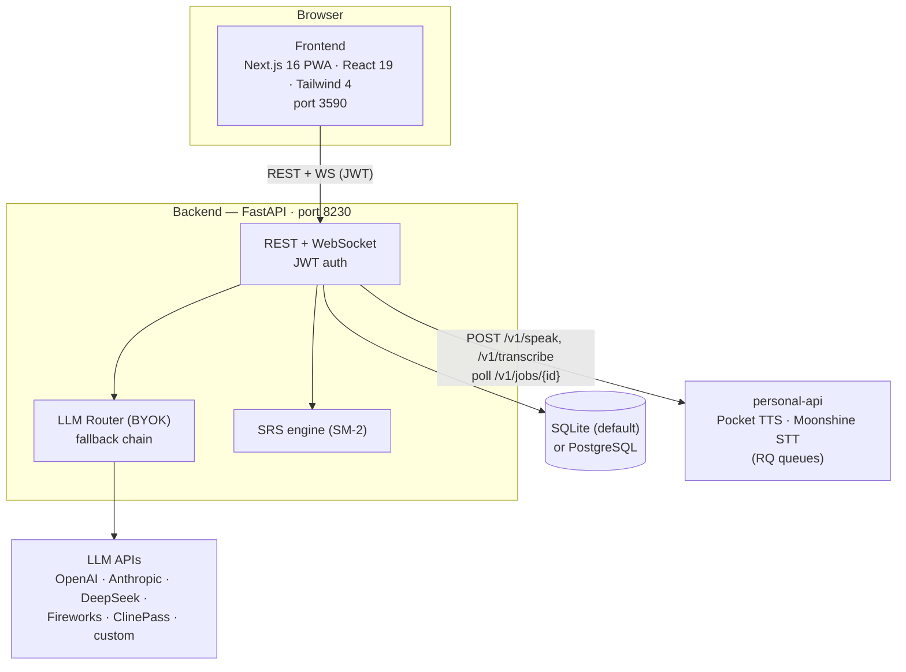
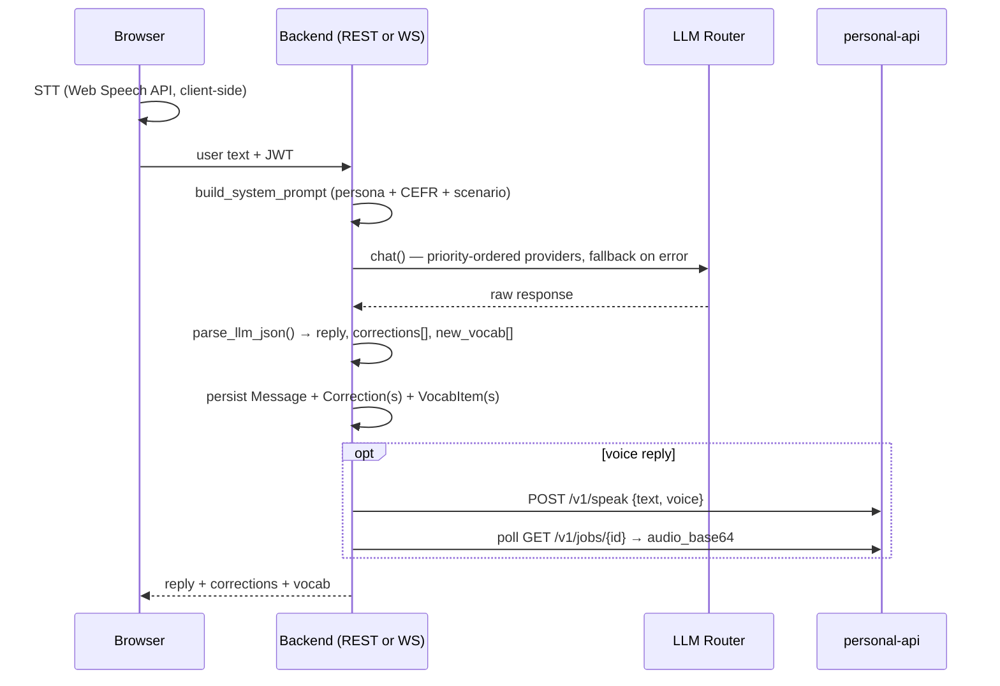

# EnglishForge — Technical Design

How the system is actually built. For *what* it does (domain, features, data model), see [`spec.md`](./spec.md). Decision history lives in [`ADR.md`](./ADR.md).

## System Context

- **Deployment**: single Docker Compose stack (`frontend`, `backend`, `db`). The compose file currently ships a `postgres:16-alpine` `db` service; the backend's code default is SQLite (`sqlite+aiosqlite:///./data/englishforge.db`, persisted on the `backend_data` volume). Both dialects are supported — the backend joins the external `coolify` network to reach `personal-api` by service name.
- **Ports**: frontend 3590, backend 8230.

## Backend Layers

| Layer | Location | Responsibility |
|---|---|---|
| Routers | `backend/app/routers/` | 12 routers: `auth`, `sessions`, `messages`, `vocab`, `scenarios`, `settings`, `dashboard`, `lessons`, `ws`, `tutor_profile`, `assessment`, `learning_paths`. All user-scoped resources go through the `get_current_user` JWT dependency. |
| LLM | `backend/app/llm/` | Provider adapters (`openai_compatible.py`, `anthropic_adapter.py`) behind a `ChatProvider` interface; `router.py` orders providers by priority, falls back through the chain, and hosts the tolerant JSON parsers (`parse_llm_json`, `parse_lesson_json`). `prompts.py` holds all system prompts plus the CEFR learning-path framework (`LEVEL_LESSONS_REQUIRED`, `NEXT_LEVEL`, `LEVEL_FOCUS`). |
| Integrations | `backend/app/integrations/` | `tts_personal_api.py` and `stt_personal_api.py` (async job submission + polling against personal-api), `stt_whisper_server.py` (faster-whisper in-process, optional dependency), `crypto.py` (Fernet encryption of provider API keys — key from `SETTINGS_ENCRYPTION_KEY` or derived from `JWT_SECRET_KEY`). |
| Domain | `backend/app/lessons/`, `backend/app/srs/` | Static lesson library (no LLM needed) and the SM-2 spaced-repetition implementation. |
| Data | `backend/app/models/`, `backend/app/schemas/` | SQLAlchemy 2.0 async ORM (15 tables) and Pydantic response schemas. |
| App | `backend/app/main.py` | Lifespan: `create_all` → `_ensure_new_columns_sync` (`_COLUMNS_TO_ADD` + savepoint guards) → `_ensure_indexes_sync` (`_INDEXES_TO_ADD` partial unique indexes) → drift validation against the ORM metadata. Global 500 handler. |

### Startup schema sync

`Base.metadata.create_all()` never alters existing tables, so the lifespan runs two idempotent syncs:

1. **Columns** — `_COLUMNS_TO_ADD` adds missing columns (`users.current_level`, `users.assessment_completed`, `progress_daily.lessons_completed`) inside `begin_nested()` savepoints; concurrent-startup races are detected and skipped, real failures are logged loudly.
2. **Indexes** — `_INDEXES_TO_ADD` creates partial unique indexes enforcing cross-request invariants (one in-progress assessment / one active learning path per user), making the corresponding application guards atomic (ADR-007).

A validation step warns if `_COLUMNS_TO_ADD` drifts from `models.py`.

## Key Flows

### Conversation turn

The conversation and assessment pages always run Web Speech API in the browser; `whisper_server` and `personal_api` STT modes execute server-side in the WS flow. (`whisper_wasm` is selectable in Settings but not yet implemented client-side.)

### Assessment completion

1. `POST /api/assessment/start` — guarded by the partial unique index `uq_assessments_user_in_progress` (one in-progress assessment per user; duplicate starts fail atomically, not via SELECT-then-INSERT).
2. Message loop — max 10 exchanges (`MAX_ASSESSMENT_EXCHANGES`). Completion is detected **server-side first**: question cap reached or `_wants_to_finish()` matches a short end-request utterance (≤4 words after punctuation stripping); the LLM's own `is_complete` flag is honored too. Each LLM call retries up to 3 times with raw-response logging (ADR-010).
3. `POST /api/assessment/{id}/complete` — sends `ASSESSMENT_ANALYSIS_PROMPT` with the full transcript, 3 attempts, parses estimated level/strengths/weaknesses/recommendations, updates the user's `current_level` and `assessment_completed`.

### Learning path generation

1. `POST /api/learning-paths/generate` (optional `assessment_id`) — the old active path is deactivated and the new path inserted atomically under the `uq_learning_paths_user_active` partial unique index.
2. Lesson target comes from `LEVEL_LESSONS_REQUIRED` for the CEFR jump; if the LLM returns fewer lessons, `lessons_required` is **capped** to the actual count so the path can always complete.
3. Up to 3 LLM attempts; parsed output is shape-validated (lessons list, allowed `lesson_type` values). `path_lessons.content` is stored as a JSON string and parsed to an object (or `null` on corrupt rows) by a Pydantic before-validator.

## Patterns Worth Knowing

- **BYOK provider config** — providers live exclusively in `provider_configs` (encrypted keys, priority, per-task routing), managed through the Settings UI. The `*_API_KEY` env vars declared in `backend/app/config.py` are **not** consumed by `LLMRouter` — there is no env seeding (TBD despite the `.env.example` comment).
- **Answer stripping** — exercise answers never leave the backend except through the exercise-check endpoints, which grade server-side and return `correct`/`correct_answer`/`explanation` (ADR-003/005/008).
- **LLM output normalization** — `normalize_llm_lesson()` coerces double-encoded JSON, non-list values, and malformed exercises before persistence (ADR-008).
- **Tolerant JSON** — all LLM responses go through `parse_llm_json` (dict-only) or `parse_lesson_json` (strict); multi-step flows retry 3× and log raw responses (ADR-010).

## External Dependencies

| Dependency | Why | Fallback |
|---|---|---|
| OpenAI-compatible / Anthropic APIs | All LLM features (conversation, correction, lessons, assessment, learning paths) | Router falls back through the priority chain; flows retry 3× |
| personal-api (Pocket TTS, Moonshine STT) | Voice output and high-accuracy transcription | Text-only works without it; Web Speech API covers live STT |
| faster-whisper | Optional server-side STT | Not in `requirements.txt` — feature is opt-in and raises a clear error if missing |
